

    
# Relocation Support

### Sidclay da Silva

### July 2020

---

### Introduction

This document contains the Capstone Report as the Week 5 peer-graded assignment for the Course IBM Applied Data Science Capstone on Coursera, which requires to develop a solution for the problem proposed by the learner in his Project Proposal assignment in Week 4, the stablished condition requires to make use of _API Foursquare_ to solve the proposed problem.

### Problem description

In our globalised world it is very common people moving around to take good opportunities, what could be a better position in their companies, new job offer, chance to learn from different cultures or improvements in quality life.

People who has already been in the situation of relocating to a unknown place, some times abroad, may have experienced the confusion and doubts to choose a place to live, near to work place or school? Near city downtown or peripheria? Decisions like this normally are also not comming alone, there are lots of stressing tasks to perform, all together.

To provide support to relocators, or relocation service providers, with the task of choosing a place, this project simulates a family relocation. Using the relocator profile, which includes venues categories priority list, and target location, a rank of different places will be provided to the relocator, giving some directions to support the evaluation process of choosing a place when relocating.

### Interested audience

Relocation service providers, which is a very common service in metroplis, certainly would have great interest in a solution which improves and speeds up selecting possible location to present to their customers.

### Input data and acquired data

#### Relocator profile - input data

Information required to rank locations, it has been arbitrary defined as following:

- __Family components__

    2 adults

    2 kids in primary school age

    1 dog as pet

- __Family priorities__

    _Primary school_ for the kids

    _Outdoor park_ to go with the kids, walk with the dog and jogging

    _Supermarket_ for the daily life

    _Pharmacy_ in case of emergencies, specially having kids

    _Subway or metro station_ to avoid traffic

- __Housing wishes__

    Apartment

    2 or 3 bedrooms

    80 m2 approximately

    1 garage spot

- __Rental budget__

    BRL 2,000.00 / month

Based on relocator profile data has been defined as following:

__Priority List__

Used to select venues using their categories, it has been stored in a _dictionay object_ containing venues categories according to the _API Foursquare_, the dictionary keys are CategoryId and dictionary values  are categories names.

<figure>
    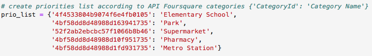
     
    <em> Fig. 1: Relocator priority list</em>
</figure>

__Rental Budget__ 

Used to indicate the districts the relocator can afford the monthly rent, it has been stored in _variable_ containg the rental budget in Brazilian Reais per square meter - BRL/m2. Enabling some flexibility and opening more options to the relocator, a tolerance range for rental prices has alson been set to +-5%, also stored in _variables_.
        
<figure>
    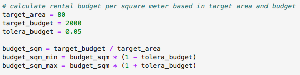
     
    <em> Fig. 2: Relocator rental budget</em>
</figure>

#### Target location - input data
        
It has been arbitrary defined to __São Paulo, Brazil__.

According to the official tourism website of the capital city São Paulo (www.cidadedesaopaulo.com) there are over 12 million inhabitants, and it is 1,521 km2 wide (see referece 1). According to the text by Ellen Kershner published on 28 May 2020 in World Atlas website (www.worldatlas.com), São Paulo metropolitan area holds the fourth largest population worldwide, over 22 million inhabitants, and it is one of the ten largest metropolis areas on the globe (see reference 2). It is the  main financial and business location in South America, alone it responds for 11% of the Brazilian GDP.
        
#### Districts information - acquired data
    
The required data were city districts and/or neighborhoods. The main city of São Paulo is divided in 5 geographical regions, 32 boroughs, 96 districts and hundreds of neighborhoods. The city division, up to the district level, can be found in the official city townhall web site (http://www.capital.sp.gov.br). Its is stored in a _XLSX_ table format into a _HTML_ page (see reference 3).

<figure>
    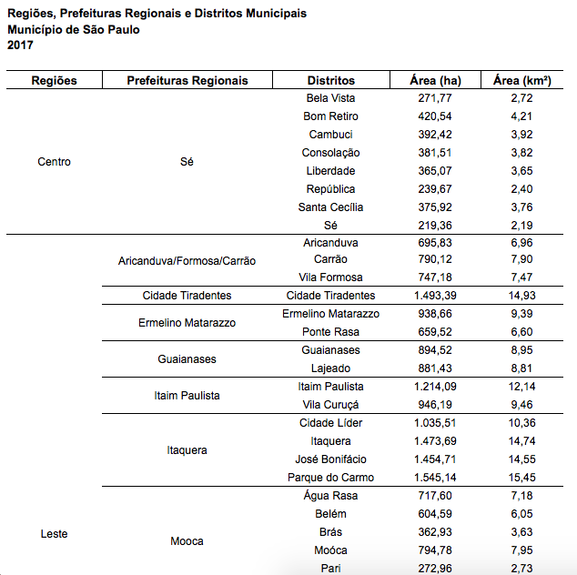
     
    <em> Fig. 3: São Paulo, regions division, source Prefeitura de São Paulo</em>
</figure>
        
Data has been collected using _Requests_ package and parsed with _BeautifulSoap_ package by _HTML_ parser. Cleaning and organizing data included removal of headers and footers rows, recognize data vs. column alignment, convert values from Brazilian standard format and treat cells with missing data. Due to the cofiguration of original table, for some rows region and borough were missing, they have been filled accordingly. Clean data have been stored in a _Pandas DataFrame_ object.

<figure>
    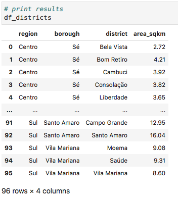
     
    <em>Fig. 4: Districts dataframe</em>
</figure>

#### Districts rental prices - acquired data
    
The required data were mean rental price per square meter in Brazilian Reais (BRL/m2) per district and/or neighborhood. There are several real estate agencies websites in São Paulo, but to find a rental prices list per district or neighborhood is a hard task.

A mixed rental prices list per district and neighborhood could be found in a real estate agency website called Blog SP Imóvel (www.spimovel.com.br), which provides its services all around the city. It hosts additional four websites covering the regions of the city. Blog ZN Imóvel (www.znimovel.com.br) for region _Norte_, Blog ZS Imóvel (www.zsimovel.com.br) for region _Sul_, Blog ZL Imóvel (www.zlimovel.com.br) for region _Leste_ and Blog ZO Imóvel (www.zoimovel.com.br) for region _Oeste_.

The websites contain each of them a list mixed with districts and neighborhoods names, it is not the complete list of city neighborhoods, but all the districts are represented. Unfortunately there is a missing relation between districts and neighborhoods, what could not be found, and for this reason missing data occoured, and have been treated accordingly (see reference 4, 5, 6 and 7).

<figure>
    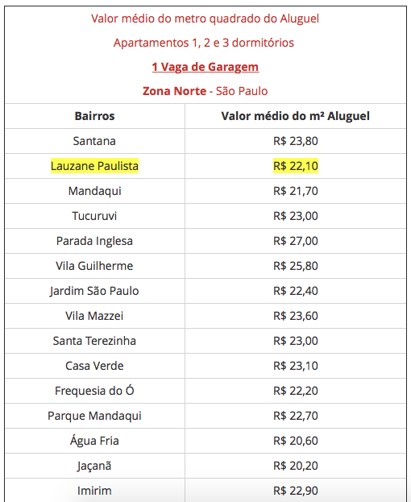
     
    <em>Fig. 5: Region Norte mean rental prices (BRL/m2), source Blog ZN Imóvel</em>
</figure>

Data has been collected using _Requests_ package and parsed with _BeautifulSoap_ package by _HTML_ parser. Cleaning and organizing data included locating relevant data from parsed content, removal of headers and footers rows, convert values from Brazilian standard format and treat cells with missing data. Locations when not enough samples were available to have mean rental price were indicated with specific text in colum mean rental price, those observations have been removed as they could not be used. Clean data have been stored in a _Pandas DataFrame_ object.
        
<figure>
    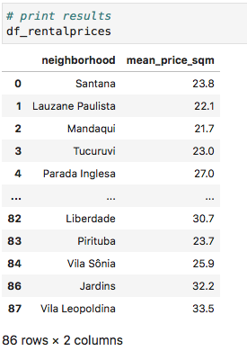
     
    <em>Fig. 6: Rental prices dataframe</em>
</figure>

When compared to the _Districts dataframe_ missing values were also found, in this case the missing values were filled with the region mean rental price. Complete data have been added to _Districts dataframe_.

<figure>
    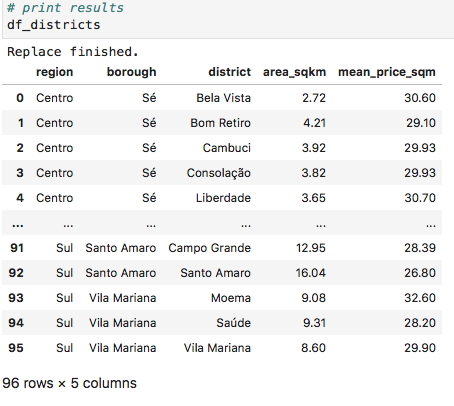
     
    <em>Fig. 7: Districts dataframe with mean rental prices (BRL/m2)</em>
</figure>

#### Districts geolocation - acquired data

Required data were districts coodinates (latitude and longitude) to allow venues search using _API Foursquare_. Geolocation data has been acquired with _Geopy_ package, the geolocator has been called using districs and boroughs names, followed by the expression _"São Paulo, BR_". When the call returned _None_, a second call has been done removing boroughs name. Cleaning and organizing data included select only relevant information and assign them to the respective district. Clean data have been stored in a _Pandas DataFrame_ object.

<figure>
    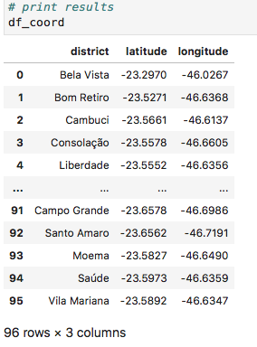
     
    <em>Fig. 8: Coordinates dataframe</em>
</figure>

Coodinates data have also been added to _Districts dataframe_.

<figure>
    
     
    <em>Fig. 9: Districts dataframe with coodinates</em>
</figure>

#### Venues information - acquired data
    
Required data were venues categories per district. A collection of venues and their categories has been created with _API Foursquare_ calls, data has been collect using _Requests_ package and parsed with _Json_ package. Cleaning and organizing data included select only venues relevant information, assign venues to the respective district and removal of not required venues categories, even when requesting the venues search with defined categories (_Priority List_), _API Foursquare_ returned sub-categories into its response, when they do exist. Clean data have been stored in a _Pandas DataFrame_ object.

<figure>
    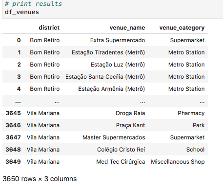
     
    <em>Fig. 10: Venues dataframe</em>
</figure>

Data has been grouped by district and counted by venue category in pivot table format, what generated missing values as (_NaN_) when categories were not found in response for specific districs. Missing values were filled with _0_ (zero).

Comparing _Venues dataframe_ against _Districts dataframe_, a few missing districts were also found, in this case none of the required venues categories was returned in response by the _API Foursquare_. Missing districts were added to the venues counting having _0_ (zero) for all venues categories, allowing them to be ranked later. Clean data have been stored in a _Pandas DataFrame_ object.

<figure>
    
     
    <em>Fig. 11: Venues count dataframe</em>
</figure>

### Methodology

#### Map of São Paulo

In case of relocation, it is important to have an overview of the target location. A map of São Paulo, with its districts grouped by colors, has been created to preview the possibilities and also to have an idea on how the districts are distributed across the city. The map has been created with _Folium_ package, and districts have been added with circle markers with different colors, one color per region.

Region differenciation with colors has been done creating a color table based on region information from _Districts dataframe_. Region color data has also been added to _Districts dataframe_.

<figure>
    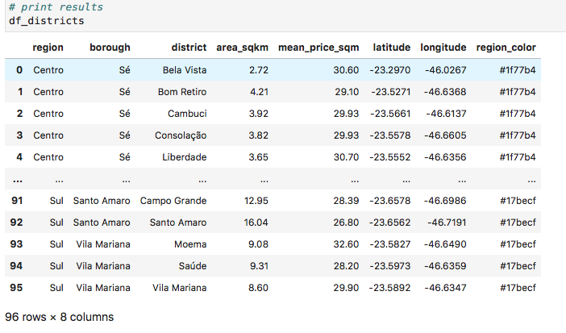
     
    <em>Fig. 12: Districts dataframe with region colors</em>
</figure>

_Folium_ map of São Paulo showing districts with region specific color.

<figure>
    
     
    <em>Fig. 13: Map of São Paulo</em>
</figure>

#### Exploratory data analysis on _Districts dataframe_

The first analysis has been done on how many districts each region counts, achieved with a bar plot created with _Matplolib_ package. Regions _Leste_ and _Sul_ concentrate a huge portion of districts.

<figure>
    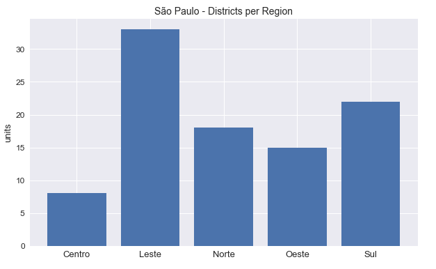
     
    <em>Fig. 14: Districts per region</em>
</figure>

Basic statistics have also been done in the dataframe, using _Pandas_ package.

<figure>
    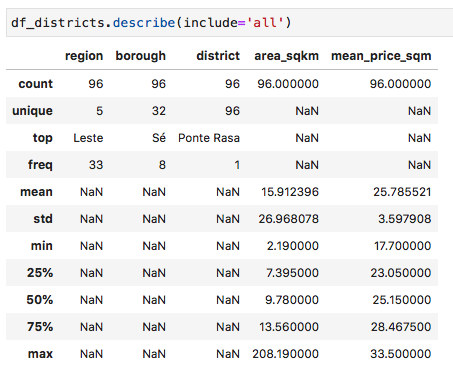
     
    <em>Fig. 15: Statistics of Districts dataframe</em>
</figure>

Interesting to notice the variation of rental prices across the city, what is expected for metropolis like São Paulo. The minimum mean rental price is __BRL 17.70/m2__ and the maximum __BRL 33.50/m2__, almost double. Mean at __25.78__ is balanced with the median at __25.15__. The range between __Q1 = 23.05__ and __Q3 = 28.47__ is not wide, but the relocator budget of __BRL 25.00/m2__ should not be an issue.

There is also huge variation in districts land area, ranging from __2.19 km2__ to __208.19 km2__, what has been considered when looking for venues with _API Fousquare_, as the radius cannot be the same for all districts, to minimize overlaping and skiping areas.

A histogram has been created with _Matplotlib_ package to visualize the mean rental prices distribution and how the relocator budget is positioned in São Paulo market.

<figure>
    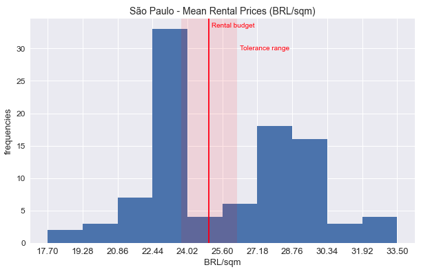
     
    <em>Fig. 16: Histogram of mean rental prices (BRL/m2)</em>
</figure>

The relocator budget is posioned on the central area of the mean rental prices histogram, unfortunately not very expressive area, but the tolerance range covers a better area of it. For better perspective, a mean rental prices histogram has been created for each region.

<figure>
    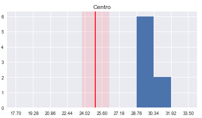
    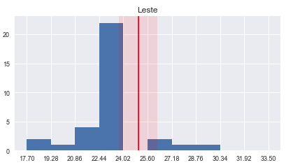
     
    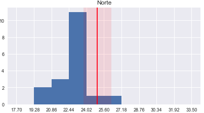
    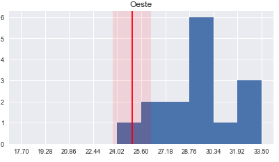
     
    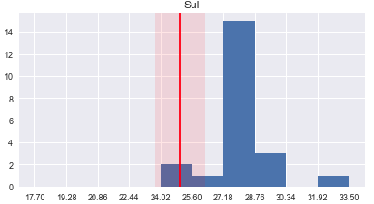
     
    <em>Fig. 17: Regions histogram of mean rental prices (BRL/m2)</em>
</figure>

From the regions histograms, it is visible that each region has a different rental prices range, with some overlaping in middle area, exception is _Centro_  region (downtown), which has higher rental prices starting from __BRL28.76/m2__. The high frequency between __22.44 and 24.02__, found in previous histogram, is concentrated in regions _Leste_ and _Norte_. Looking only at the mean rental prices, except from _Centro_, all the other regions are candidates for relocation.

#### Create _Districts Rank_

The rank has been based on groups of districts, created on their similarities. To group them __Machine Learning Techniques__ has been used, specific for this simulation __Clustering Technique__ with __DBSCAN algorithm__ - _Density-Based Spatial Clustering of Applications with Noise_. The choice for _DBSCAN_ was done because it is capable to detect clusters with different densities, sizes and shapes, it does not require to define a number of clusters to start and it can also identify noise and outliers among the data.

The required data to run the clustering process have been combined in one dataframe, categories from __Priority List__ each of the districts contain, what is available in _Venues Count dataframe_, and __mean rental price__ per district, what is available in _Districts dataframe_. Both dataframes have been mergeded into a new dataframe using _Pandas_ package.

<figure>
    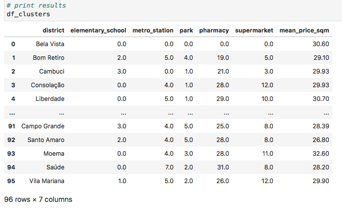
     
    <em>Fig. 18: Clusters dataframe</em>
</figure>

Data have also been prepared for clustering as following:

- District column has been removed, as it is not a feature value.

- Venues categories counting has been converted to _0_ or _1_, to consider if venue category is available for each district.

    __0__ when __counting = 0__
    
    __1__ when __counting > 0__

- Mean rental prices has been converted into three groups, to consider rental prices below, into or above the budget tolerance range.

    __0__ when below rental prices tolerance range __(mean_price_sqm < 23.75)__
    
    __1__ when into rental prices tolerance range __(23.75 <= mean_price_sqm <= 26.25)__
    
    __2__ when above rental prices tolerance range __(mean_price_sqm > 26.25)__

Additionally the column _mean_price_sqm_ has been renamed to _rental_group_.

<figure>
    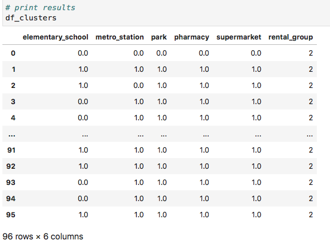
     
    <em>Fig. 19: Clusters dataframe after data preparation</em>
</figure>

Having data prepared, _DBSCAN_ from _SciKit-Learn_ package has been modeled with minimum samples equals three (_min_sample = 3_), to have at least three districts per cluster, and maximum distance between smaple equals to 0.5 (_eps = 0.5_), to have high level of similarity within cluster elements. Eight clusters and one outliers group have been defined.

<figure>
    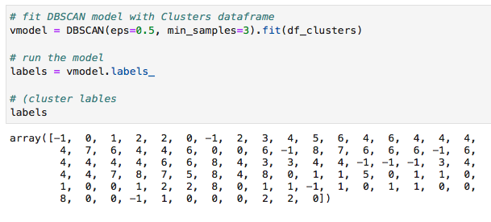
     
    <em>Fig. 20: DBSCAN results</em>
</figure>

### Results

#### Cluster analysis

Initially the size of each cluster has been checked, first the defined clusters have been attached to _Clusters dataframe_ and then it has been grouped by _cluster_label_ to count the observations.

<figure>
    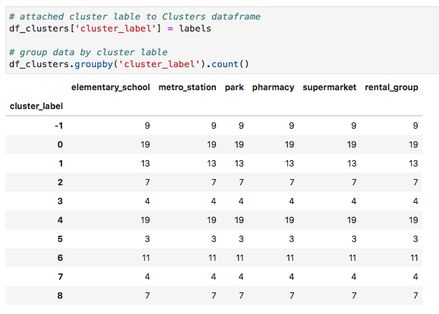
     
    <em>Fig. 21: Clusters size</em>
</figure>

_DBSCAN_ has defined clusters with many different sizes, and outliers group _-1_ counted with _9_ districts, about 9,3% of the districts.

As the features have been converted to _0 / 1_ for venues categories and _0 / 1 / 2_ for rental group, the clusters characteristcs could be easily analysed calculating the mean of each feature per cluster. It has been grouped again by _cluster_label_, but this time the _mean_ has been calculated.

<figure>
    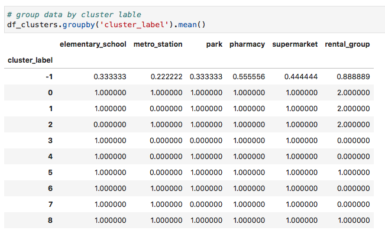
     
    <em>Fig. 22: Clusters characteristcs by mean</em>
</figure>

- Venues Categories (Elementary School / Metro Station / Park / Pharmacy / Supermarket)

    mean = 0: cluster does not contain any district with such venue category, see _elementary_school_ in cluster 2
    
    mean = 1: cluster contains only districts with such venue category, see _elementary_school_ in cluster 0
    
- Rental Group

    mean = 0: cluster contains only districts with in group 0, see cluster 3
    
    mean = 1: cluster contains only districts with in group 1, see cluster 5
    
    mean = 2: cluster contains only districts with in group 2, see cluster 1
    
- Outliers

    mean < 0: districts which does not fit to any cluster

From the summary above the clusters could be defined, and the districts ranked, as following:

- Outliers:

    Group -1

- Priority List not satisfied:

    Cluster 1, missing Metro Station
    
    Cluster 2, missing Elementary School

    Cluster 3, missing Metro Station and Park

    Cluster 4, missing Metro Station

    Cluster 5, missing Metro Station

    Cluster 7, missing Park

- __Priority List satisfied:__

    Cluster 0, Rental Group 2 (above rental price tolerance range)

    Cluster 6, Rental Group 0 (below rental price tolerance range)

    __Cluster 8, Rental Group 1 (into rental price tolerance range)__

Goal is to find districts containing the five categories in __Priority List__ and rental prices into tolerance range, __rental group 1__. From the _Districts Rank_ above, this goal is achieved by districts in ___cluster 8___, which contains seven districts with all the required characteristics.

Clusters definition have been attached to _Venues Count dataframe_ to allow selecting details about districts by cluster.

<figure>
    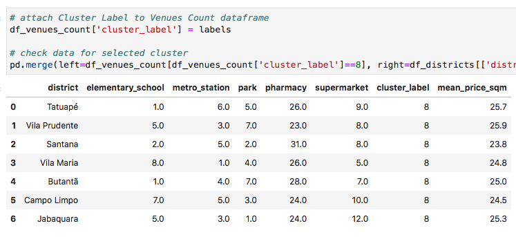
     
    <em>Fig. 23: Cluster 8, districts details</em>
</figure>

#### Map of São Paulo with selected districts

A map of São Paulo with selected districts infopoints provides a better visualization.

<figure>
    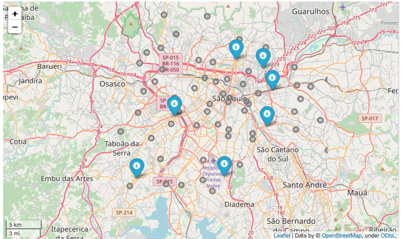
     
    <em>Fig. 24: Map of São Paulo with selected districts</em>
</figure>

### Discution

One of the majors learned lessons within this project was its chronogram estimation, mainly the effort estimation, this is not an easy task and should be cautiosly performed. Learning about the problem in hand, searching for suitable data, handling data acquisition and cleaning took a huge portion of the time, as they were by far the hardest tasks to perform. From my side, these tasks have been underestimated, the lack of experience in such field was probably the reason. From the planning side, issues arised from the thecnical infrastructure, as I was using free web service with limited month machine run time to develop the project, I got out of resources and had to manage a new local environment, what also took me time. As expected internet and several forums have been handy to solve technical and coding issues. Fortunately I have been ahead of the course schedule and the deadline has not been compromised.

Because of its characteristics, this project did not offer the opportunity to perform fancy statistical or data analysis, what also includes data visualization, but it covered the major portion of the content learned during the whole specialization/certification.

Research on machine learning techniques to find the best fit for the project also brough huge opportunity for learning, during the time of the project I joined four data science online groups. During the clustering phase, the model tunning was a great joy, it was intersting trying to uderstand how _DBSCAN_ managed the data.

Developing this project was a great learning opportunity and it brought me good practical experience.

### Conclusion

In this project a simulation has been developed for a family relocation to one of the biggest cities in the world. Using the relocator profile as input and data acquired from different sources, a _District Rank_ has been created to give the relocator, or relocation service provider, some directions on which districts satisfy the requirements of the relocator.

The input data was done arbitrary considering a hypotetical family and target location, data about city and rental prices have been found and scraped from internet (see references). This simulation has made use of geolocation data to define location coordinates and to retrieve venues information from _API Foursquare_. Having the required data, _DBSCAN_ algorithm, a machine learning technique, has been used to cluster districts and create the _Districts Rank_. From 96 districts in the target location, seven matched the relocator requirements and have been presented in table format and displayed on a map.

The project has successfully achieved its goal.

### Future directions

I have already been more then once in the position of relocating with my family, wife and kids, to unknown places. This project solves a real world problem people faces every day around the world.

This simulation has proved itself as a good solution for the proposed problem, and it could be enhanced to become a configurable and flexible tool with market value. If operated by relocation service providers, dynamic values as mean rental prices could be maintained by users or service administrators.

It could also aggregate more parameters such as not wanted venues categories, eg. cemitery, measuring distances from a defined point, eg. work place, and even searching for rental advertisements after creating the districts rank.

It has great potencial for future developments.

### References

1. Cidade de São Paulo, Dados e Fatos
    
    http://cidadedesaopaulo.com/v2/pqsp/dados-e-fatos/?lang=pt
    
1. WorldAtlas, The Largest Cities In The World By Population
    
    https://www.worldatlas.com/articles/the-10-largest-cities-in-the-world.html
    
1. Prefeitura de São Paulo (SP) Regiões, Prefeituras Regionas e Distritos, as of in June 2020.

    http://www.prefeitura.sp.gov.br/cidade/secretarias/upload/urbanismo/infocidade/htmls/3_regioes_prefeituras_regionais_e_distrito_2017_10895.html
    
1. Blog ZN Imóvel, list from 26 February 2020
    
    https://www.znimovel.com.br/blog/qual-o-valor-do-metro-quadrado-do-aluguel-dos-apartamentos-na-zona-norte-de-sao-paulo/2834/
    
1. Blog ZS Imóvel, list from 6 March 2020
    
    https://www.zsimovel.com.br/blog/qual-o-valor-do-metro-quadrado-do-aluguel-dos-apartamentos-na-zona-sul-de-sao-paulo/2874/
    
1. Blog ZL Imóvel, list from 28 February 2020
    
    https://www.zlimovel.com.br/blog/qual-o-valor-do-metro-quadrado-do-aluguel-dos-apartamentos-na-zona-leste-de-sao-paulo/2824/
    
1. Blog ZO Imóvel, list from 28 February 2020
    
    https://www.zoimovel.com.br/blog/qual-o-valor-do-metro-quadrado-do-aluguel-dos-apartamentos-na-zona-oeste-de-sao-paulo/2851/
